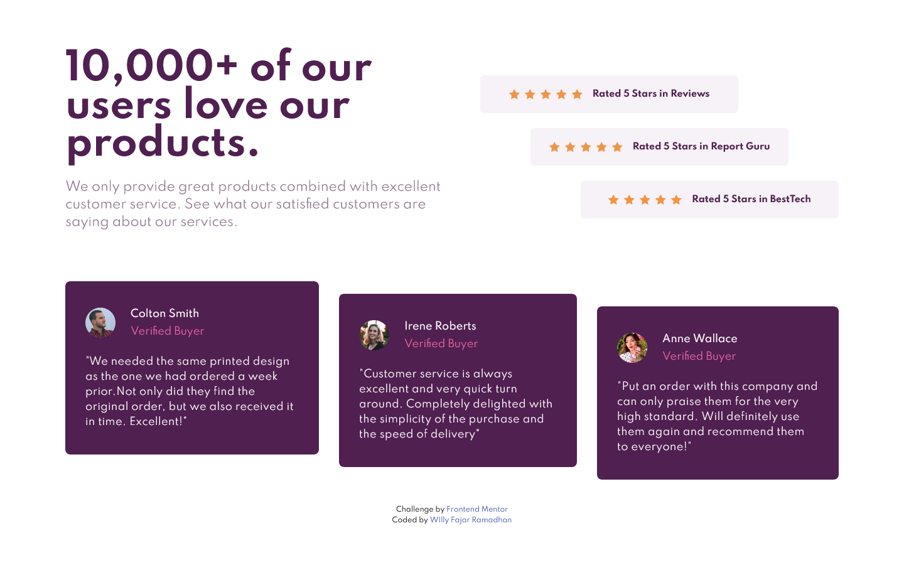

# Frontend Mentor - Social proof section solution

This is a solution to the [Social proof section challenge on Frontend Mentor](https://www.frontendmentor.io/challenges/social-proof-section-6e0qTv_bA). Frontend Mentor challenges help you improve your coding skills by building realistic projects.

## Table of contents

- [Overview](#overview)
  - [The challenge](#the-challenge)
  - [Screenshot](#screenshot)
  - [Links](#links)
- [My process](#my-process)
  - [Built with](#built-with)
  - [What I learned](#what-i-learned)
- [Author](#author)

**Note: Delete this note and update the table of contents based on what sections you keep.**

## Overview

### The challenge

Users should be able to:

- View the optimal layout for the section depending on their device's screen size

### Screenshot

Desktop preview:  

 
Mobile preview:  

### Links

- [Solution URL](https://github.com/wllyvx/frontendmentor-social-proof-section)
- [Live Site](https://wllyvx.github.io/frontendmentor-social-proof-section/)

## My process

### Built with

- Semantic HTML5 markup
- CSS custom properties
- Flexbox
- Mobile-first workflow
- [TailwindCSS](https://tailwindcss.com/) - For styles

**Note: These are just examples. Delete this note and replace the list above with your own choices**

### What I learned

I learned how to position the div manually using translate

## Author

- Willy Fajar Ramadhan
- Frontend Mentor - [@wllyvx](https://www.frontendmentor.io/profile/wllyvx)
- Github - [wllyvx](https://github.com/wllyvx)
- Twitter - [@willyframadhan](https://www.twitter.com/willyframadhan)
